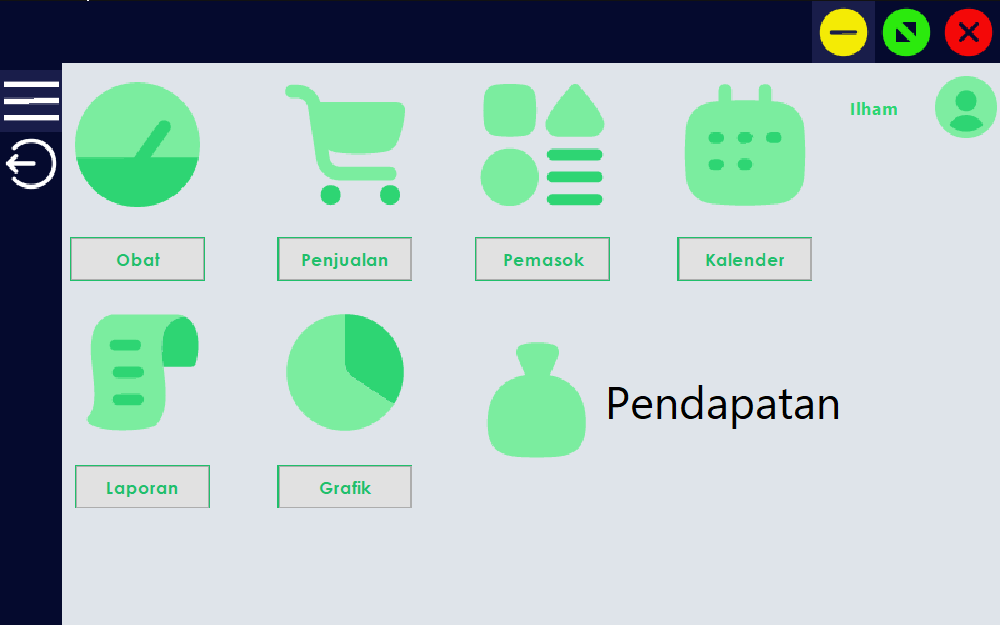
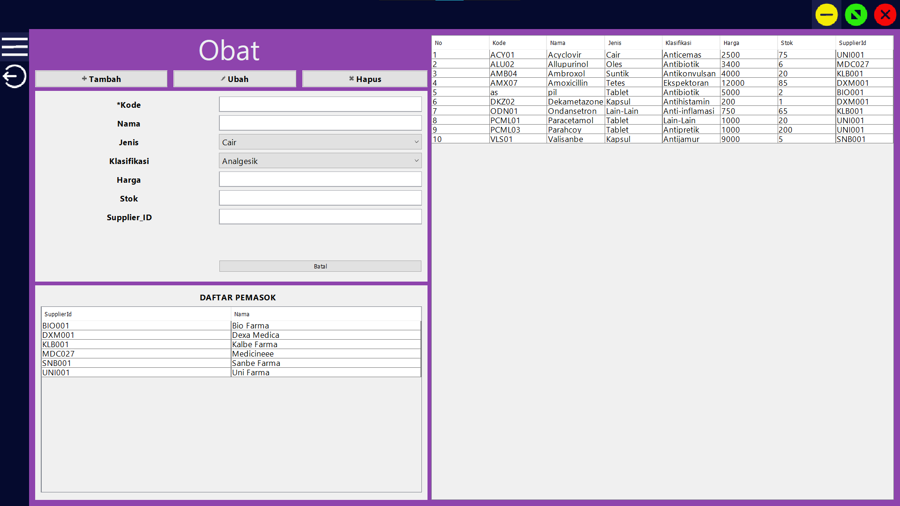
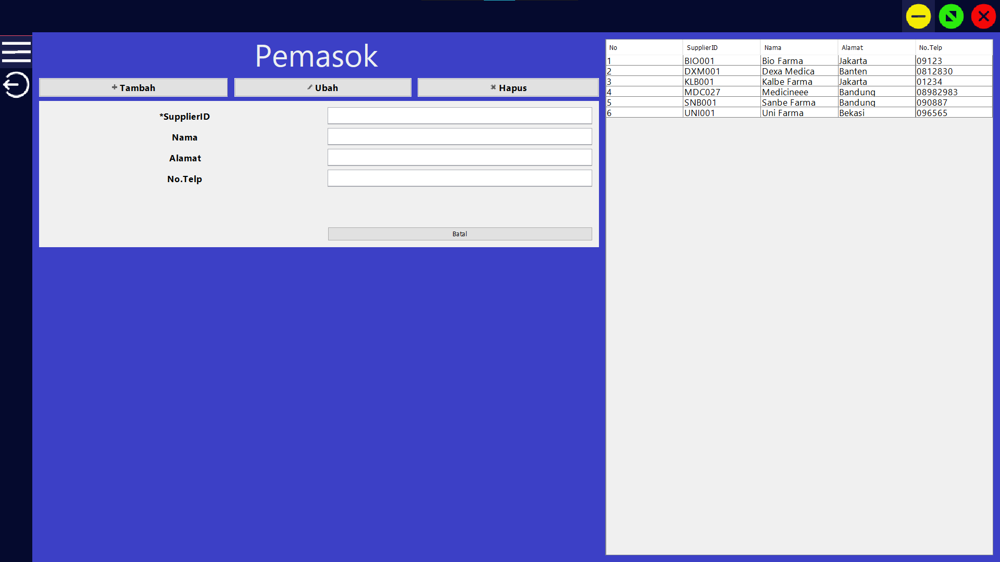
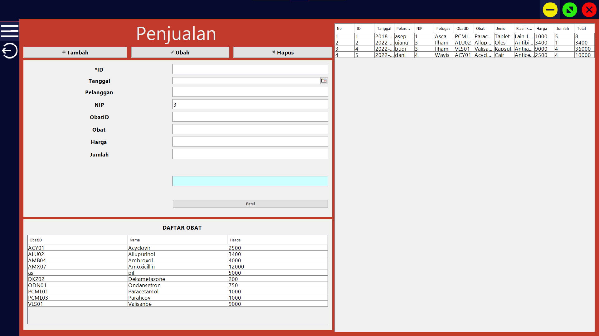

<a name="readme-top"></a>

<!-- PROJECT LOGO -->
<br />
<div align="center">
  <a href="https://github.com/IlhamLamp/java-Sistem_Informasi_Apotek">
    
  </a>

  <h3 align="center">Sistem Informasi Apotek</h3>

  <p align="center">
    Berbasis GUI dan MultiUser
    <br />
    <br />
    <a href="https://www.tiktok.com/@apotekpermata_pbo/video/7185924091608616218?is_from_webapp=1&sender_device=pc&web_id=7164575964569126401">View Demo</a>
    ·
    <a href="https://github.com/IlhamLamp/java-Sistem_Informasi_Apotek/issues">Report Bug</a>
    ·
    <a href="https://github.com/IlhamLamp/java-Sistem_Informasi_Apotek/issues">Request Feature</a>
  </p>
  <div align="center"> ANGGOTA KELOMPOK :
    <br>
    Ananda Prasca Appandi (312010157)
    <br>
    Fahmi Eko Putro Santoso (312010046)
    <br>
    Ilham Nur Utomo (312010129)
    <br>
    Wayis Al Qorni TS (312010169)
  </div>
</div>

<!-- ABOUT THE PROJECT -->

## About The Project



Apotek sebagai salah satu institusi pelayanan dalam bidang kesehatan yang membutuhkan keberadaan suatu informasi yang akurat, handal, dan memadai untuk meningkatkan pelayanan kepada pasien serta lingkungan yang terkait lainnya. Dengan adanya sistem informasi memudahkan para petugas dalam pengelolahan data seperti: proses penginputan data, proses pengambilan data, pengupdatean data dan sejenisnya.

Menu yang tersedia:

- Obat, semua stok obat-obatan dapat ditampung disini.
  </br>
- Pemasok, sumber obat yang dikirim berasal dari sini.
  </br>
- Penjualan, transaksi dilakukan disini.
  </br>
- Kalender X
- Laporan X
- Grafik X

<p align="right">(<a href="#readme-top">back to top</a>)</p>

### Built With

Teknologi yang digunakan

- Java
- NetBeans

<p align="right">(<a href="#readme-top">back to top</a>)</p>

### Installation

- Clone the repo
  ```sh
  git clone https://github.com/IlhamLamp/java-Sistem_Informasi_Apotek.git
  ```

<p align="right">(<a href="#readme-top">back to top</a>)</p>
